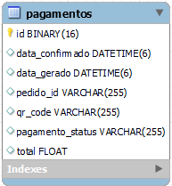

# Pagamentos Techchallenge
## Sobre o projeto
O projeto é uma API backend de pagamentos, a API conta com os métodos necessários para fazer a criação e consulta de pagamentos PIX QrCode através do MercadoPAgo, a documentação contacom as instruções de uso e mapeamento de endpoints. O projeto conta com arquitetura Clean Architecture, tecnologia Java, utilizando Spring, Hibernate, Maven, JDBC entre outros frameworks, MySQL para banco de dados e Docker para conteinerização e provisionamento da aplicação.

## Pré-Requisitos
1. Java 21
2. Maven 4.0.0
3. Docker

## Validação dos Pré-Requisitos
Para validar se todos os pré-requisitos estão devidamente instalados, rode os comandos abaixos:
1. Java = "java --version"
2. Maven = "mvn -v"
3. Docker = "docker -v"

## Passo a passo para inicializar aplicação
1. Clone este repositório.
2. Dentro do repósitorio pagamentos_ms_techchallenge, importe o projeto na sua IDE de preferência.
3. Rode os comandos abaixo:

- docker compose up

Após a execução dos comandos com sucesso é possível realizar todas as operações abaixo dentro do Postman em relação a pedidos, produtos e clientes.

## Collection do Postman
[pagamentos_ms_techchallenge.postman_collection.json](pagamentos_ms_techchallenge.postman_collection.json)

## Swagger
http://localhost:8181/swagger-ui/index.html

## Banco de dados



# Services
## Cria Pagamento (QrCode)
**Endpoint:** *api/pagamentos_ms_techchallenge/pagamentos*<br />
**Método:** *POST*
<br />
**Description:** Método responsável por criar pagamentos na API MercadoPago.
<br />
**Request Example:**
<br />
```json
{
  "pedidoId":"asdasdasd56r576",
  "total": 670.50
}
```

## Busca Pagamento (TODOS)
**Endpoint:** *api/pagamentos_ms_techchallenge/pagamentos*<br />
**Método:** *GET*
<br />
**Description:** Método responsável por buscar todos os pagamentos registrados no banco de dados.
<br />
**Request Example:**
<br />
```
Path parameter
```
## Busca Pagamento (CRIADOS)
**Endpoint:** *api/pagamentos_ms_techchallenge/pagamentos/status/CRIADO*<br />
**Método:** *GET*
<br />
**Description:** Método responsável por buscar pagamentos com STATUS CRIADO.
<br />
**Request Example:**
<br />
```
Path parameter

